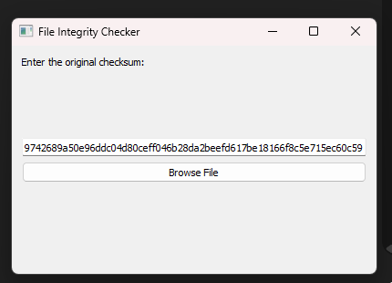
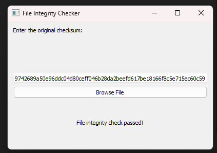

# File Integrity Checker

This is a Python-based GUI application built using **PyQt5** that allows you to verify the integrity of files by comparing their calculated checksum with the original checksum you provide.

## Features:
- **Browse and Upload**: Browse and upload files from your local system.
- **Checksum Comparison**: Input the original checksum and compare it with the calculated checksum of the uploaded file.
- **Supported Algorithm**: SHA-256 (default, but you can modify the script for other algorithms).

## Requirements:
- **Python 3.x**
- **PyQt5**
- **hashlib** (Built-in Python module)

### Installation

1. **Clone the repository**:
   ```bash
   git clone https://github.com/yourusername/file-integrity-checker.git
   cd file-integrity-checker

Screenshots:


